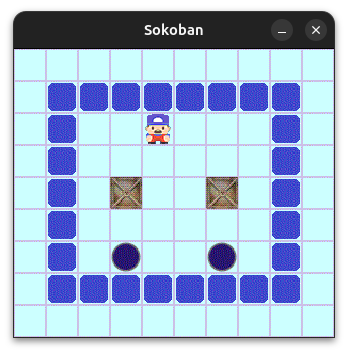

# Sokoban

Sokoban est une implémentation du célèbre jeu de puzzle où le joueur doit pousser des caisses sur des destinations spécifiques dans un labyrinthe.

## Fonctionnalités

- **Mode Graphique** : Une interface graphique utilisant `Swing` pour jouer au jeu.
- **Mode Texte** : Une interface en mode console pour jouer au jeu.
- **Gestion des cartes** : Chargement des cartes depuis des fichiers texte.
- **Enchaînement des niveaux** : Les cartes `map1.txt`, `map2.txt` et `map3.txt` sont jouées successivement.
- **Réinitialisation du niveau** : Réinitialisez le niveau actuel avec la touche `r`.
- **Déplacements** : Déplacement du joueur avec gestion des collisions et des règles du jeu.

## Exemple d'Interface

Voici un exemple de l'interface graphique du jeu :



## Structure du Projet

- **`src/Modele`** : Contient les classes principales pour la logique du jeu (e.g., `Carte`, `Joueur`, `Caisse`, etc.).
- **`src/VueGraphique`** : Contient les classes pour l'interface graphique (e.g., `VueSokoban`, `Sokoban`).
- **`src/VueTexte`** : Contient les classes pour l'interface en mode texte (e.g., `ModeTexte`, `SokobanTexte`).
- **`bin/map`** : Contient les fichiers de cartes pour les niveaux du jeu.

## Prérequis

- **Java 8 ou supérieur** : Assurez-vous que Java est installé sur votre machine.
- **IDE ou Terminal** : Vous pouvez exécuter le projet depuis un IDE comme IntelliJ IDEA ou Eclipse, ou directement depuis le terminal.

## Instructions d'Installation

1. Clonez le dépôt ou téléchargez les fichiers.
2. Assurez-vous que les fichiers de cartes sont dans le dossier `bin/map`.
3. Compilez les fichiers source avec `javac`.

## Instructions d'Exécution

### Mode Graphique

1. Exécutez la classe `Sokoban` :
   ```bash
   java -cp src VueGraphique.Sokoban
   ```
2. Ou utilisez le fichier `sokobanBastien.jar` :
   ```bash
   java -jar sokobanBastien.jar
   ```

### Mode Texte

1. Exécutez la classe `ModeTexte` :
   ```bash
   java -cp src VueTexte.ModeTexte
   ```
2. Ou utilisez le fichier `sokobanTexteBastien.jar` :
   ```bash
   java -jar sokobanTexteBastien.jar
   ```

## Contrôles

- **Z** : Déplacer vers le haut.
- **Q** : Déplacer vers la gauche.
- **S** : Déplacer vers le bas.
- **D** : Déplacer vers la droite.
- **R** : Réinitialiser le niveau actuel.

## Fichiers de Cartes

Les fichiers de cartes sont situés dans le dossier `bin/map`. Chaque fichier représente un niveau du jeu. Voici un exemple de carte :

```
#####
#@  #
#$ .#
#####
```

- `#` : Mur
- `@` : Joueur
- `$` : Caisse
- `.` : Destination

Les cartes sont jouées dans l'ordre suivant :
1. `map1.txt`
2. `map2.txt`
3. `map3.txt`

## Contribution

Les contributions sont les bienvenues ! Veuillez soumettre une pull request ou ouvrir une issue pour signaler des bugs ou proposer des améliorations.

## Licence

Ce projet est sous licence MIT. Vous êtes libre de l'utiliser, de le modifier et de le distribuer.

---
